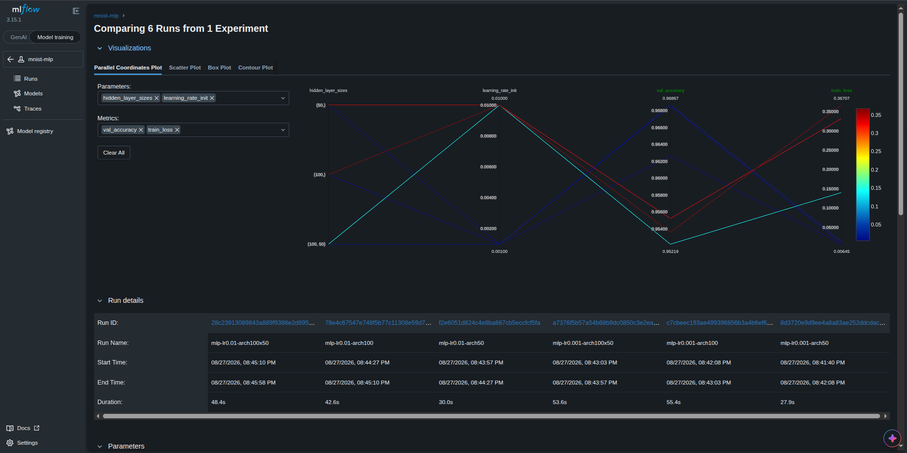
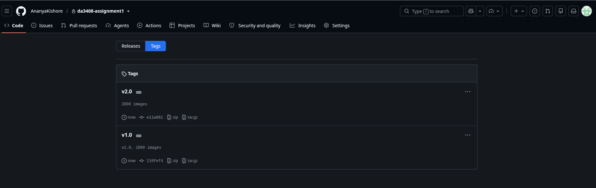
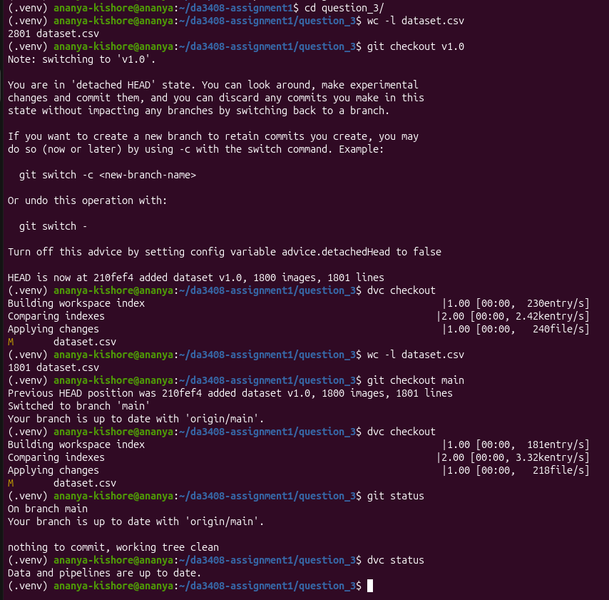

# DA3408 - Assignment 1

## Structure

```text
da3408-assignment1/
├── question_2/
│   ├── q2_MLflow.png
│   ├── question_2.ipynb
│   └── requirements.txt
├── question_3/
│   ├── .dvc/
│   ├── .dvcignore
│   ├── .gitignore
│   ├── dataset.csv.dvc
│   ├── question_3.png
│   └── tags.png
├── AI_DISCLOSURE.md
├── README.md
└── Report_DA3408_Assignment1.pdf
```

---

## To run the experiments:

```bash
git clone https://github.com/AnanyaKishore/da3408-assignment1.git
cd da3408-assignment1
```
---

# Question 1
**The solutions are detailed in the attached PDF `Report_DA3408_Assignment1.pdf`.**
  
---

# Question 2

- Navigate to `question_2/`
- **The required image and solutions are detailed in the attached PDF `Report_DA3408_Assignment1.pdf`.** The image is attached here for more clarity:


- `question_2.ipynb` runs 6 experiments, training the MNIST dataset using MLPs of varying configurations:
  - `lr = (0.01, 0.001)`
  - `architecture = [(100,), (100, 50), (50,)]`

### To run the notebook, navigate to question_2/ on your terminal:

```bash
pip install -r requirements.txt
```

In a separate terminal, run:

```bash
mlflow server \
  --backend-store-uri sqlite:///mlflow.db \
  --default-artifact-root ./mlruns \
  --host 0.0.0.0 \
  --port 5000 \
  --allowed-hosts "*" \
  --cors-allowed-origins "http://localhost:5000,http://127.0.0.1:5000"
```

- Open `http://localhost:5000` in your browser.

In the first terminal, run:

```bash
jupyter nbconvert --to notebook --execute question_2.ipynb --inplace
```

At `http://localhost:5000`, under **Experiments**, you will see `mnist-mlp`. Click on it, select all experiments, and click **Compare** to see the plots.

---

# Question 3

Navigate to `question_3/` to view the artifacts and the commits corresponding to the DVC initialisation, adding the S3 remote, and creating versions 1 and 2 of `dataset.csv`. 

**It is an experiment run entirely on the terminal**. The commits corresponding to this experiment, committed on **August 30, 2026**, are:

- [`d4aa1a3`](https://github.com/AnanyaKishore/da3408-assignment1/commit/d4aa1a3) *initialise dvc for question_3/*
- [`3bd4e89`](https://github.com/AnanyaKishore/da3408-assignment1/commit/3bd4e89) *added dataset v1.0, 1800 images, 1801 lines*
- [`e67746c`](https://github.com/AnanyaKishore/da3408-assignment1/commit/e67746c) *added s3 remote for question_3/*
- [`5210bc6`](https://github.com/AnanyaKishore/da3408-assignment1/commit/5210bc6) *added dataset.csv v2.0, 2800 images, 2801 lines*

The tags `v1.0` and `v2.0` can be found under the **Tags** dropdown:




### To recreate the experiment on your terminal:

Create a new folder and navigate to it. Run the following commands:

```bash
pip install dvc-s3 awscli
git init
dvc init
git commit -m "initialise dvc for question_3/"

dvc get https://github.com/iterative/dataset-registry tutorials/versioning/data.zip
unzip -q data.zip
rm -f data.zip
echo "filename" > dataset.csv
find data -type f | head -n 1800 >> dataset.csv
wc -l dataset.csv # 1801 lines
dvc add dataset.csv
git add dataset.csv.dvc .gitignore
git commit -m "added dataset v1.0, 1800 images, 1801 lines"
git tag -a "v1.0" -m "v1.0, 1800 images"

dvc remote add -d myremote s3://da3408-ananya-s3/dvc_storage # s3 remote I used
git add .dvc/config
git commit -m "added s3 remote for question_3/"
dvc push

dvc get https://github.com/iterative/dataset-registry tutorials/versioning/new-labels.zip
unzip -q new-labels.zip
rm -f new-labels.zip
echo "filename" > dataset.csv
find data -type f | head -n 2800 >> dataset.csv
wc -l dataset.csv # 2801 lines
dvc add dataset.csv
git commit -am "added dataset.csv v2.0, 2800 images, 2801 lines"
git tag -a "v2.0" -m "2800 images"
dvc push
git push origin --tags # to push v1.0 and v2.0 tags

# checkout v1.0
git checkout v1.0
dvc checkout
wc -l dataset.csv # will show 1801 lines
```

- **To verify that my experiment worked correctly, refer to the image attached in `Report_DA3408_Assignment1`.** It is attached here for more clarity:



---

# Question 4
I assumed the role of Partner A, which required me to write and run the code, version the dataset using DVC, set up the `environment.yml` file, and finally share a GitHub repository with all the artifacts, all of which are identical to the question_4/ folder.

## The repository used by my partner and I is: [q4demo](https://github.com/AnanyaKishore/q4demo). Please use this repository for the evaluation.

Author: Ananya Kishore (DA24B035)